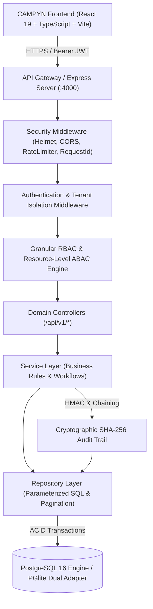
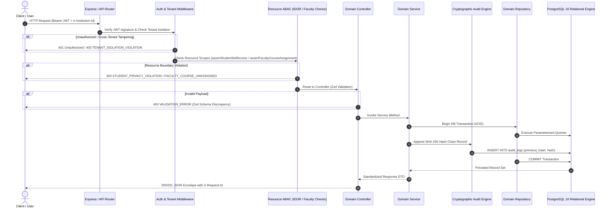

# CAMPYN V2 — System Architecture Specification

## 1. Executive Overview

CAMPYN V2 is a production-grade, multi-tenant Higher Education Operating System engineered to replace fragmented legacy ERPs with a cohesive, auditable, high-performance platform. The system is designed as a **modular monolith** with clean boundaries between presentation, routing, authorization, service logic, data persistence, and cryptographic auditing.



---

## 2. Request Lifecycle & Layered Clean Architecture

Every incoming HTTP request undergoes strict step-by-step verification before touching business domain logic or database records:



---

## 3. Technology Stack & Design Decisions

| Layer | Technology | Decision Justification |
| :--- | :--- | :--- |
| **Frontend Framework** | React 19 + TypeScript | High render efficiency, strict type definitions matching backend DTOs. |
| **Build Tooling** | Vite 8 + Rollup | Instant hot-reloading in dev and optimized compressed production chunks. |
| **Backend Runtime** | Node.js + TypeScript (`tsx`) | Strong asynchronous I/O performance and unified full-stack typing. |
| **HTTP Server** | Express 4 + Helmet + CORS | Minimal overhead, proven security headers, standard middleware chaining. |
| **Validation Engine** | Zod 3 | Runtime schema validation with typed static inference for zero-trust API boundaries. |
| **Database Engine** | PostgreSQL 16 (Relational Pool) | ACID guarantees, foreign key constraints, JSONB support, and row-level locking. |
| **Local Test Engine** | `@electric-sql/pglite` (WASM PG16) | 100% native PostgreSQL SQL dialect compatibility without docker or external daemon dependencies. |
| **Cryptography** | Node.js `crypto` + SHA-256 + bcryptjs | Secure salt-hashed credentials and deterministic audit log blockchaining. |
| **Testing** | Vitest + Supertest | Sub-second isolated test execution with parallel file safety. |

---

## 4. Multi-Tenant Institution Isolation

1. **Relational Tenant Keys**: Every institutional table (`departments`, `courses`, `students`, `faculty`, `attendance_sessions`, `fee_structures`, `approval_requests`, `audit_logs`) contains a foreign key reference to `institutions(id)`.
2. **Server-Side Boundary Enforcement**: The `enforceTenantIsolation` middleware compares the authenticated caller's `req.user.institutionId` with any requested headers, URL parameters, or body payloads. Cross-tenant access attempts immediately fail with HTTP 403 `TENANT_ISOLATION_VIOLATION`.
3. **Automatic Repository Scoping**: All SQL statements incorporate `WHERE institution_id = $1` filters parameterized directly from `req.user.institutionId`.

---

## 5. Directory Structure

```
CAMPYN_APP/
├── database/
│   ├── migrations/
│   │   ├── 001_initial_schema.sql
│   │   └── 002_security_constraints.sql
│   └── schema.sql
├── docs/
│   ├── ARCHITECTURE.md
│   ├── AUTHENTICATION.md
│   ├── AUTHORIZATION.md
│   ├── DATABASE.md
│   ├── API.md
│   ├── SECURITY.md
│   ├── AUDIT.md
│   ├── DEPLOYMENT.md
│   └── TESTING.md
├── server/
│   ├── config.ts
│   ├── index.ts
│   ├── controllers/
│   ├── db/
│   │   ├── index.ts
│   │   ├── migrate.ts
│   │   └── seed.ts
│   ├── middleware/
│   │   ├── auth.ts
│   │   ├── rbac.ts
│   │   ├── tenantIsolation.ts
│   │   ├── resourceAuth.ts
│   │   ├── requestId.ts
│   │   ├── rateLimiter.ts
│   │   └── errorHandler.ts
│   ├── repositories/
│   ├── routes/
│   ├── services/
│   └── validators/
├── src/
│   ├── components/
│   ├── features/
│   ├── hooks/
│   ├── services/
│   └── types/
└── tests/
    ├── auth.test.ts
    ├── rbac.test.ts
    ├── transactions.test.ts
    ├── audit.test.ts
    ├── security_idor.test.ts
    ├── tenant_isolation.test.ts
    └── faculty_assignment.test.ts
```
