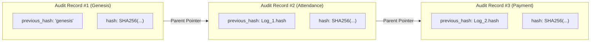

# CAMPYN V2 — Cryptographic Append-Only Audit Trail

## 1. Overview & Regulatory Rationale

Higher education regulatory bodies (e.g. NAAC, ABET, FERPA) demand tamper-evident auditability for high-stakes actions:
- Grade entry and revisions
- Attendance recording and corrections
- Fee collections and refunds
- Enrollment state changes
- Governance approvals and rejections

CAMPYN V2 implements a **Cryptographic Hash-Chained Audit Trail** where each log entry forms an immutable link in a SHA-256 blockchain stored within PostgreSQL.

---

## 2. Hash Chaining Algorithm

Each record in `audit_logs` contains:
- `previous_hash VARCHAR(64)`: The SHA-256 hash of the immediate predecessor.
- `hash VARCHAR(64)`: The SHA-256 hash of the current record.

### Hash Computation Formula
```
H_n = SHA256( H_{n-1} + canonicalJson(payload) + AUDIT_CHAIN_SALT )
```

Where:
- `H_{n-1}` is `'genesis'` for the initial institutional record, or the preceding row's `hash`.
- `payload` includes `{ actorId, role, action, entity, entityId, oldValues, newValues, reason, timestamp }`.
- `canonicalJson()` recursively sorts all JSON keys lexicographically to guarantee 100% deterministic serialization regardless of object property ordering in database retrieval.
- `AUDIT_CHAIN_SALT` is a server-side secret preventing external rainbow table generation.



---

## 3. Cryptographic Verification & Tamper Detection

The system provides an automated verification engine available at `GET /api/v1/audit/verify`:

1. It retrieves all audit log records ordered by `created_at ASC`.
2. It initializes `expectedPrevHash = 'genesis'`.
3. For each log entry:
   - It checks whether `row.previous_hash === expectedPrevHash`. If not, **tampering (record insertion/deletion) is detected**.
   - It recomputes the expected hash using `canonicalJson(payload)` and the salt. If the computed hash differs from `row.hash`, **tampering (in-place row modification) is detected**.
   - `expectedPrevHash = row.hash`.
4. If all records match, it confirms 100% cryptographic integrity.

```typescript
// Verified in tests/audit.test.ts:
const verification = await verifyAuditChain();
expect(verification.isValid).toBe(true);
```
