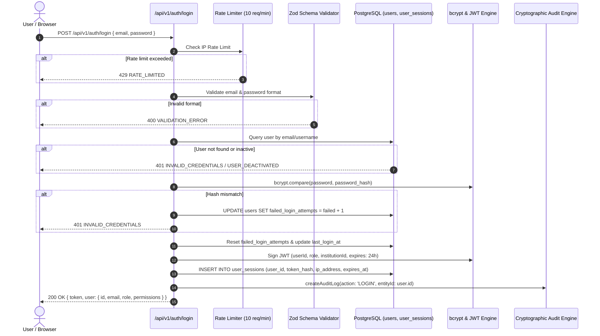

# CAMPYN V2 — Authentication & Identity Architecture

## 1. Authentication Flow Diagram



---

## 2. Password Security & Hashing Standards

1. **Algorithm**: Blowfish Cryptographic Hash (`bcrypt`) with an adaptive work cost of **10 salt rounds**.
2. **Storage**: Plaintext passwords are never logged, serialized, or stored. Only salted bcrypt hashes (`$2a$10$...`) are written to PostgreSQL.
3. **Lockout Policy**: Accounts record `failed_login_attempts`. If failed attempts exceed 5, the account is temporarily locked via `locked_until TIMESTAMPTZ` to defeat dictionary and credential stuffing attacks.

---

## 3. Session Management & Revocation

Every successful authentication records an active session in `user_sessions`:

```sql
CREATE TABLE user_sessions (
    id UUID PRIMARY KEY DEFAULT gen_random_uuid(),
    user_id UUID NOT NULL REFERENCES users(id) ON DELETE CASCADE,
    token_hash VARCHAR(255) NOT NULL,
    ip_address VARCHAR(45),
    user_agent TEXT,
    expires_at TIMESTAMPTZ NOT NULL,
    revoked_at TIMESTAMPTZ,
    created_at TIMESTAMPTZ DEFAULT CURRENT_TIMESTAMP
);
```

### Session Revocation Mechanisms

- **Single Device Logout (`POST /api/v1/auth/logout`)**: Deletes or marks current session token revoked in `user_sessions`.
- **Global Logout (`POST /api/v1/auth/logout-all`)**: Revokes all active sessions for the user:
  ```sql
  UPDATE user_sessions SET revoked_at = CURRENT_TIMESTAMP WHERE user_id = $1 AND revoked_at IS NULL;
  ```
- **Token Invalidation on Password Reset**: When a user changes their password, all active sessions are revoked instantly.

---

## 4. Rate Limiting Protection

- `/api/v1/auth/login`: Strictly throttled to **10 requests per minute** per client IP using `express-rate-limit`.
- Test environments (`NODE_ENV=test`) bypass rate limiting to enable comprehensive end-to-end test execution.
