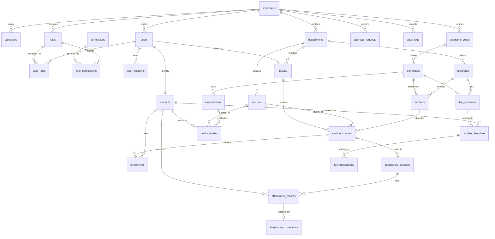

# CAMPYN V2 — Relational Database Architecture

## 1. Entity-Relationship (ER) Diagram



---

## 2. Dual-Mode PostgreSQL Architecture

To guarantee high scalability in production alongside effortless, zero-dependency developer onboarding, CAMPYN V2 utilizes a **Dual-Mode Database Adapter** (`server/db/index.ts`):

1. **Production Mode (`DATABASE_URL` defined)**:
   - Uses `pg.Pool` with connection pooling (20 max connections, 30s idle timeout).
   - Compatible with Amazon RDS, Supabase, Neon, GCP Cloud SQL, or self-hosted PostgreSQL 16.
2. **Local / Testing Mode (`DATABASE_URL` empty)**:
   - Mounts `@electric-sql/pglite` (embedded WebAssembly-compiled PostgreSQL 16 engine).
   - Persists state in `./data/campus_pg`.
   - Executes 100% native PostgreSQL SQL dialect, constraints, and transactions without requiring local Docker or PostgreSQL installations.

---

## 3. Database Migration System

Migrations reside in `/database/migrations/` and follow a strict sequential naming convention (`001_initial_schema.sql`, `002_security_constraints.sql`).

### Migration Tracking Schema
```sql
CREATE TABLE IF NOT EXISTS _schema_migrations (
    id SERIAL PRIMARY KEY,
    migration_name VARCHAR(255) UNIQUE NOT NULL,
    applied_at TIMESTAMPTZ DEFAULT CURRENT_TIMESTAMP
);
```

### Migration Execution Lifecycle
1. The migration runner (`server/db/migrate.ts`) scans the migrations directory.
2. It queries `_schema_migrations` to identify pending scripts.
3. Each pending migration executes in an isolated transaction.
4. Upon successful DDL execution, the migration filename is recorded in `_schema_migrations`.
5. Running `npm run migrate` or starting the server verifies that all migrations are up to date idempotently.

---

## 4. ACID Transaction Safety (`withTransaction`)

Critical institutional workflows (such as fee collection, refund reversals, attendance session recording, and approval resolutions) must never result in partially updated states. CAMPYN wraps operations with the `withTransaction` manager:

```typescript
export async function withTransaction<T>(
  callback: (tx: DbClient) => Promise<T>
): Promise<T>
```

Example in fee settlement:
```typescript
await withTransaction(async (tx) => {
  // 1. Lock invoice record with row-level lock
  const due = await tx.query(`SELECT ... FOR UPDATE`);
  // 2. Insert transaction record
  await tx.query(`INSERT INTO fee_transactions ...`);
  // 3. Update outstanding balance
  await tx.query(`UPDATE student_fee_dues ...`);
  // 4. Record cryptographic audit trail
  await createAuditLog({ ... }, tx);
});
```
If any step fails, the entire transaction rolls back cleanly.

---

## 5. High-Performance Indexing Strategy

To guarantee sub-10ms response times across tens of thousands of students:
- `idx_users_institution_email` on `users(institution_id, email)`
- `idx_students_institution_roll` on `students(institution_id, roll_number)`
- `idx_attendance_records_lookup` on `attendance_records(session_id, student_id)`
- `idx_attendance_sessions_date` on `attendance_sessions(section_course_id, session_date)`
- `idx_audit_logs_chain` on `audit_logs(institution_id, created_at)`
- `idx_audit_logs_hash` on `audit_logs(hash)`
- `idx_fee_transactions_due` on `fee_transactions(student_fee_due_id, created_at)`
